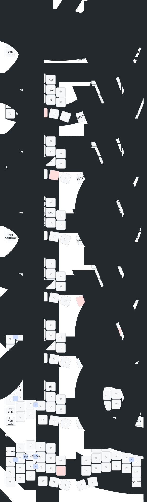

# zmk-config-roBa

roBa キーボード用の ZMK ファームウェア設定リポジトリです。

## 概要

| 項目 | 内容 |
|------|------|
| キーボード | roBa（分割キーボード） |
| キー数 | 43キー |
| MCU | Seeeduino XIAO BLE (nRF52840) |
| 接続 | Bluetooth |
| トラックボール | PMW3610（右手側） |
| ZMK Studio | 対応 |

## ファームウェアの取得

1. このリポジトリをフォークまたはクローン
2. GitHub Actions が自動でビルドを実行
3. Actions タブから最新のビルド成果物（`firmware.zip`）をダウンロード
4. 解凍して `.uf2` ファイルを取得

### ファームウェアファイル

| ファイル | 用途 |
|----------|------|
| `roBa_R-seeeduino_xiao_ble.uf2` | 右手側（トラックボール側） |
| `roBa_L-seeeduino_xiao_ble.uf2` | 左手側 |
| `settings_reset-seeeduino_xiao_ble.uf2` | 設定リセット用 |

## 書き込み方法

### 初回セットアップ（両側に実施）

1. PCとマイコンをUSB接続（電源オフのまま）
2. リセットボタンを素早く2回押してブートローダーモードに入る
3. `XIAO-SENSE` というドライブが表示される
4. **まず `settings_reset-seeeduino_xiao_ble.uf2` をドラッグ＆ドロップ**
5. 再度リセットボタンを2回押してブートローダーを起動
6. メインファームウェア（`roBa_L` または `roBa_R`）をドラッグ＆ドロップ
7. 左右両方に同じ手順を実施
8. 電源を入れ、Bluetoothで「roBa」が認識されれば完了

### ファームウェア更新時

1. リセットボタンを素早く2回押してブートローダーモードに入る
2. `XIAO-SENSE` というドライブが表示される
3. 更新する側のファームウェア（`.uf2`）をドラッグ＆ドロップ

## 依存モジュール

| モジュール | 説明 |
|------------|------|
| [ZMK Firmware](https://github.com/zmkfirmware/zmk) | ZMK本体（v0.3-branch） |
| [zmk-pmw3610-driver](https://github.com/kumamuk-git/zmk-pmw3610-driver) | PMW3610トラックボールドライバー |
| [zmk-layout-shift](https://github.com/kot149/zmk-layout-shift) | JIS配列対応モジュール |

## JIS配列対応

[zmk-layout-shift](https://github.com/kot149/zmk-layout-shift) を使用してJIS配列に対応しています。

OSがJIS配列に設定されている場合でも、記号キーが正しく入力されます。

### JIS/US配列の切り替え

Layer 6 の左上キーに `tog_ls`（Toggle Layout Shift）を割り当てています。

| 状態 | 説明 |
|------|------|
| Layout Shift OFF | US配列として動作（デフォルト） |
| Layout Shift ON | JIS配列として動作 |

OSの設定がJIS配列の場合は `tog_ls` を押してLayout Shiftを有効にしてください。

## Auto Mouse Layer

トラックボールを動かすと自動的にMOUSEレイヤー（Layer 4）が有効になります。

Input Processor方式を採用しており、以下の機能があります：

| 設定 | 値 | 説明 |
|------|-----|------|
| タイムアウト | 10秒 | 操作がないと自動で解除 |
| 誤爆防止 | 200ms | キー入力直後のカーソル移動では発動しない |
| 除外キー | マウスボタン | マウスボタンを押してもレイヤーは解除されない |

## Mod-Tap / Layer-Tap 設定

`&mt`（mod-tap）と `&lt`（layer-tap）に以下の設定を適用しています：

| 設定 | 値 | 説明 |
|------|-----|------|
| flavor | balanced | ホールド/タップの判定方式 |
| quick-tap-ms | 150ms | 連続タップ時に即タップとして認識する間隔 |

- **balanced**: 他のキーを押すとホールド、離すとタップとして判定
- **quick-tap-ms**: 素早い連続入力（例: "aa"）がしやすくなる

## Keymap

